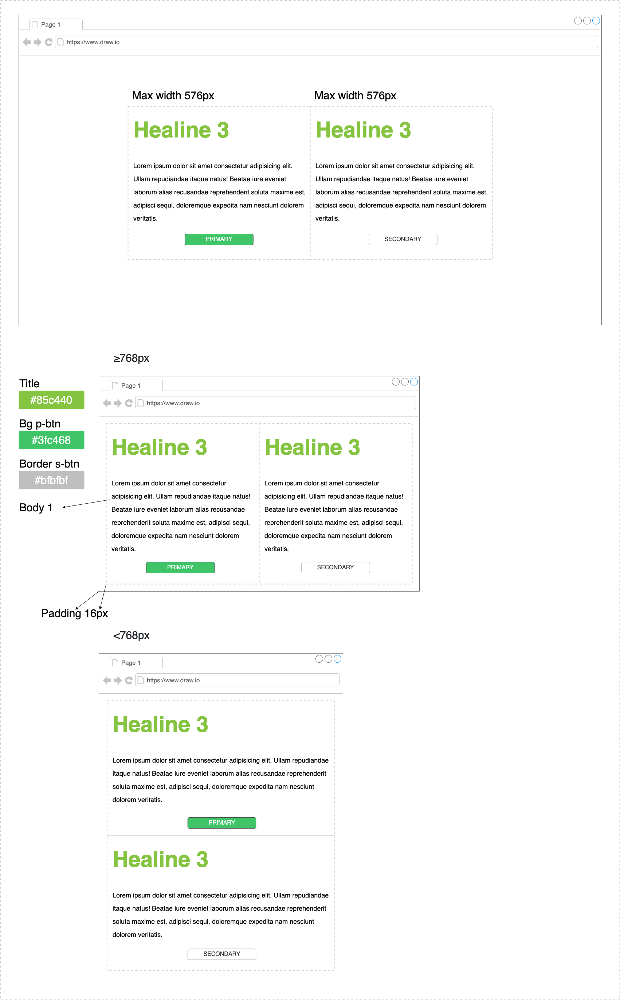

# **DESIGN SYSTEM** Styles Demo
This project is a small demo to check, validate and choose what kind of styles is the better option for a design system

***
## Instructions:
* Branch the project with the name of the technology or type of styles you will use
* With the technology or type of styles you selected, implement all the layout shown below
* Create a color palette
* Implement the defined types of typography `Headline 3, Body 1 & BUTTON` based on Material, which you can check in the following link `https://material.io/design/typography/the-type-system.html#type-scale`
* Give dynamic styles to the button component, which you define through *prop `type`* to make it `primary` or `secondary`, which is already defined in the following path `src/components/Button/Button.jsx`
* Preferably use **flexbox** for layout

***
## Script to run the project
### `npm start`
Runs the app in the development mode.\
Open [http://localhost:3000](http://localhost:3000) to view it in the browser.

The page will reload if you make edits.\
You will also see any lint errors in the console.

***
This project was bootstrapped with [Create React App](https://github.com/facebook/create-react-app).